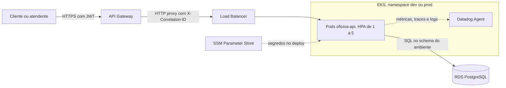

# fiap_tech_challenge_oficina_api

API da oficina mecânica: clientes, veículos, catálogo de peças e serviços e ordens de serviço. Roda no EKS, atrás do API Gateway, e grava no RDS PostgreSQL. Faz parte do Tech Challenge Fase 3:

| Repositório | Responsabilidade |
|---|---|
| fiap_tech_challenge_oficina_api | Este repositório. Aplicação principal, no EKS |
| [fiap_tech_challenge_oficina_auth_lambda](https://github.com/gabrielov2003/fiap_tech_challenge_oficina_auth_lambda) | Autenticação por CPF e API Gateway |
| [fiap_tech_challenge_oficina_infra_k8s](https://github.com/gabrielov2003/fiap_tech_challenge_oficina_infra_k8s) | Rede, cluster EKS, segredos e Datadog |
| [fiap_tech_challenge_oficina_infra_database](https://github.com/gabrielov2003/fiap_tech_challenge_oficina_infra_database) | Banco de dados RDS PostgreSQL |

## Arquitetura



O código segue DDD com arquitetura hexagonal:

| Arquivo | Papel |
|---|---|
| `src/domain.py` | Entidades, validação de CPF, CNPJ e placa, e transições da OS |
| `src/ports.py` | Interfaces de repositórios, saúde do banco e métricas |
| `src/application.py` | Casos de uso |
| `src/infrastructure.py` | Repositórios PostgreSQL e métricas do Datadog |
| `src/web.py` | Rotas, controle de acesso por perfil e Swagger |
| `src/observabilidade.py` | Logs JSON e correlation id |
| `src/app.py` | Monta a aplicação e injeta os adapters |

## Autenticação e perfis

| Perfil | Como obtém o token | O que acessa |
|---|---|---|
| `admin` (funcionário) | `POST /api/login` com usuário e senha | Todas as rotas |
| `cliente` | `POST /auth` no API Gateway, com o CPF | Abrir OS para si, listar as próprias OS e aprovar ou recusar o orçamento delas |

Rotas públicas: `GET /api/os/{id}`, `GET /api/os/{id}/status`, `POST /api/os/webhook/status` (com o token do webhook), `GET /api/health` e `GET /api/ready`.

Na nuvem, a senha do `admin` de cada ambiente fica no SSM, em `/oficina/<env>/admin_password`.

## Swagger

* Nuvem: `<URL do gateway>/apidocs/`, com a barra no final. A URL do gateway está em `/oficina/<env>/gateway_url` no SSM.
* Local: `http://localhost:5000/apidocs/`.

Gere o token (`POST /api/login` para funcionários ou `POST /auth` no gateway para clientes), clique em Authorize e informe `Bearer <token>`.

## Fluxo da ordem de serviço

Recebida, Em diagnóstico, Aguardando aprovação e então Aprovado, Recusada ou Solicitado alterações, que volta para Em diagnóstico. Aprovado segue para Em execução ou Aguardando peças, e depois Finalizada e Entregue. Transições fora dessa ordem são rejeitadas. A troca de status só grava se o status lido ainda for o atual, e cada mudança entra em `historico_status_os`, base do tempo médio por status em `GET /api/os/tempo-medio`.

## Banco de dados

As tabelas são criadas pela API na inicialização, dentro de um advisory lock, então várias réplicas sobem juntas sem conflito. Cada ambiente usa o próprio schema (`dev` ou `prod`) no mesmo RDS. A justificativa do banco, o diagrama ER e os relacionamentos estão no [README do infra_database](https://github.com/gabrielov2003/fiap_tech_challenge_oficina_infra_database).

## Observabilidade

* Logs JSON no stdout com `correlation_id`, `dd.trace_id`, rota, status e duração de cada requisição.
* APM com `ddtrace-run`, que mede a latência por endpoint.
* Healthcheck em `/api/health` (liveness) e `/api/ready` (readiness, testa o banco), usados pelas probes e pelo `http_check` do Datadog.
* Métricas de negócio pelo DogStatsD:

| Métrica | O que mede |
|---|---|
| `oficina.os.abertas` | OS abertas, base do volume diário |
| `oficina.os.status_alterado` | Mudanças de status |
| `oficina.os.tempo_status` | Segundos em cada status, com a tag `status` |
| `oficina.os.falhas` | Falhas no processamento de OS, com a tag `operacao` |
| `oficina.integracao.erros` | Erros no webhook, com as tags `integracao` e `motivo` |

O dashboard e os alertas são criados pelo `infra_k8s`.

## Como rodar localmente

Pré-requisitos: Docker e, para os testes, Python 3.11+. O `.env.example` traz todas as variáveis.

```bash
cp .env.example .env
docker compose up --build
```

A API sobe em `http://localhost:5000`. Login: `POST /api/login` com `{"username": "admin", "senha": "admin123"}`.

Para mandar os dados ao Datadog, preencha `DD_API_KEY` e `DD_SITE` no `.env` e suba junto o agente. Os dados chegam com a tag `env:local`:

```bash
docker compose -f docker-compose.yml -f docker-compose.datadog.yml up -d --build
```

## Testes

Rodam contra um PostgreSQL real:

```bash
docker compose up -d db
python -m pip install -r requirements.txt -r requirements-dev.txt
python -m pytest tests/unit_tests.py -v
```

Cobrem os cadastros, o fluxo completo da OS, as permissões por perfil, o token no formato da Lambda, o histórico e o tempo médio, as restrições do banco, o webhook, os healthchecks e o correlation id.

## Kubernetes

Os manifestos em `k8s/` são preenchidos pelo pipeline com `envsubst`:

| Arquivo | O que cria |
|---|---|
| `namespace.yaml` | Namespace do ambiente |
| `configmap.yaml` | Conexão com o banco, sem a senha, e schema |
| `secret.yaml` | Senha do banco, chave JWT, token do webhook e senha do admin, lidos do SSM |
| `deployment.yaml` | Pods com probes, limites de CPU e memória, tags do Datadog e `http_check` |
| `service.yaml` | LoadBalancer usado pelo API Gateway |
| `hpa.yaml` | Escala de 1 a 5 pods por CPU (70%) ou memória (80%) |

## CI/CD

| Branch | Ambiente | Namespace e schema |
|---|---|---|
| `dev` | dev | `dev` |
| `main` | prod | `prod` |

| Job | Quando roda | O que faz |
|---|---|---|
| `test` | Pull requests e pushes em `dev` e `main` | Testes com um PostgreSQL de serviço e Bandit |
| `build` | Push em `dev` ou `main` | Build da imagem e push no ECR `oficina-api` |
| `deploy` | Depois do build | Lê o SSM, aplica os manifestos, espera o rollout e publica a URL do LoadBalancer em `/oficina/<env>/api_url`, usada pelo API Gateway |

Secrets: `AWS_ACCESS_KEY_ID` e `AWS_SECRET_ACCESS_KEY`. Variável opcional: `AWS_REGION` (padrão `us-east-1`). Sem as credenciais, só os testes rodam.

Ordem do primeiro deploy: `infra_k8s`, `infra_database`, esta API e por último a `auth_lambda`.

## Documentação

RFCs, ADRs, diagramas e roteiro do vídeo: [documentacao_fase3](https://github.com/gabrielov2003/TechChallenge1/tree/main/documentacao_fase3).

---
Este projeto faz parte do Tech Challenge da Pós Graduação em Arquitetura de Software da FIAP.
